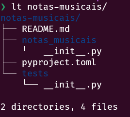
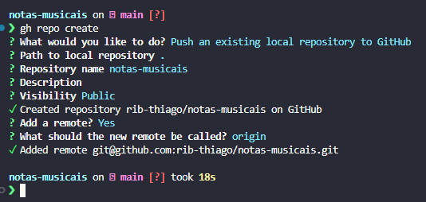

# Pacote Python com Poetry

Instalar o poetry:
```bash {.line-numbers}
curl -sSL https://install.python-poetry.org | python3 -
```

Criar Pacote com poetry:
```bash b{.line-numbers}
poetry new <nome-Pacote>
```

Mesmo com hifen no nome do diretório, o poetry vai criar um pacote com o nome separado por underline, como é a regra para nomes de pacotes.



O nome do diretório continua com hifen por ser mais de digitar, em urls por exemplo.

Subir o projeto para o git hub:
Criar Pacote com poetry:
```bash b{.line-numbers}
gh repo create
```



Criando arquivo .gitignore com auxilio da ferramenta *ignr*:

```bash {.line-numberers}
# instalar

pip install ignr

# usar:

ignr -p python >> .gitignore
```