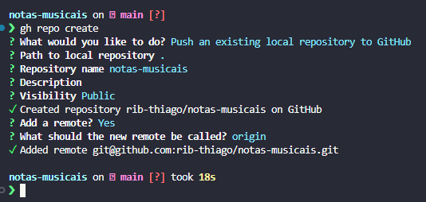
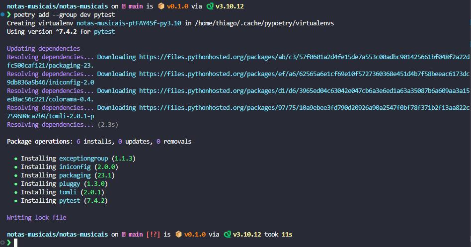
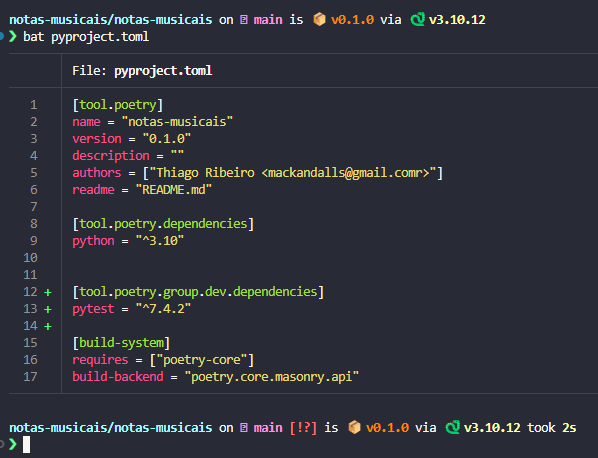
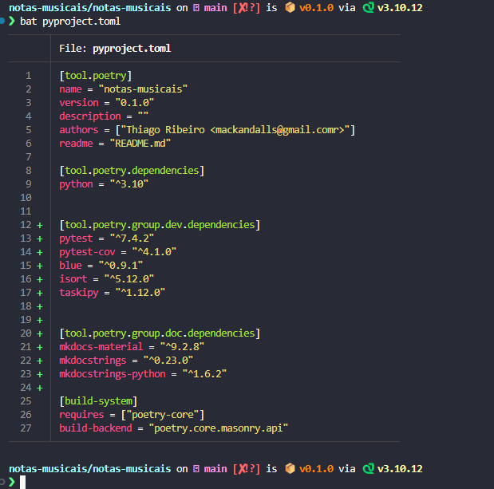
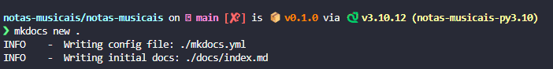
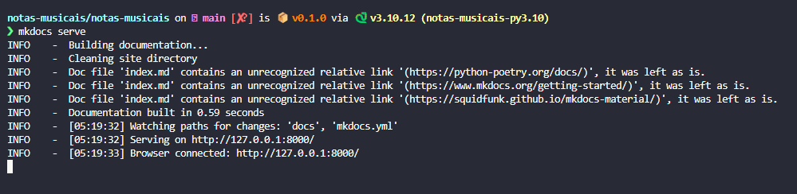
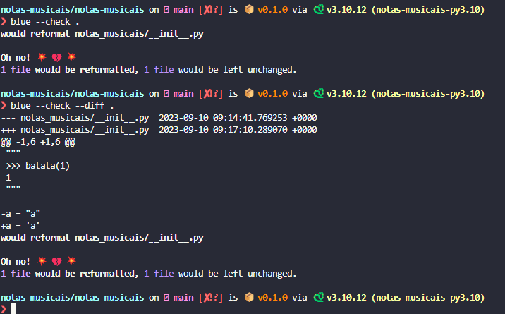
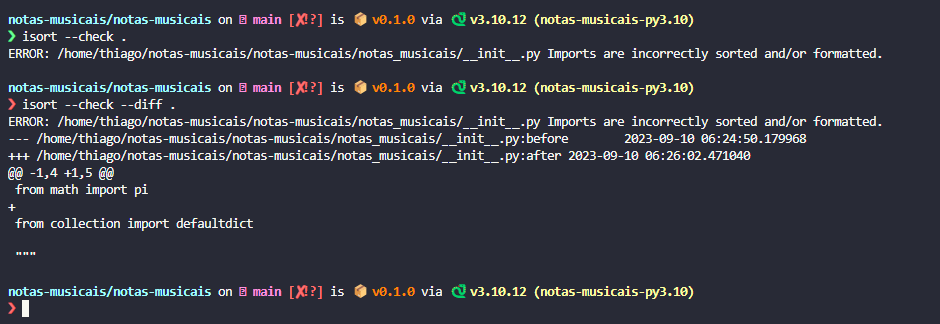

# Ferramentas de configuração de ambiente de Desenvovlimento

O presente artigo visa descrever o processo de instalação de ferramentas de apoio ao desenvolvimento com python.


## Etapas

### 1. Gerenciamento de Dependências

Para o Gerenciamento de Depedências, utilizaremos o [poetry]:

- Instalar o poetry:
~~~
curl -sSL https://install.python-poetry.org | python3 -
~~~

- Criar Pacote com poetry:
~~~
poetry new <nome-Pacote>
~~~

Mesmo com hifen no nome do diretório, o poetry vai criar um pacote com o nome separado por underline, como é a regra para nomes de pacotes.


O nome do diretório continua com hifen por ser mais de digitar, em urls por exemplo.

### 2. Gerenciamento de Repositórios Remotos

Para o Gerenciamento dos Repositórios Remotos, utilizaremos o [gh]:

- Subir o projeto para o github:
~~~
gh repo create
~~~




#### 2.1. Geração de arquivo `.gitignore`

Para a Geração de Arquivo `.gitignore`, utilizaremos o [ignr]:

- Instalando o [ignr]

~~~
pip install ignr
~~~

- Criando arquivo .gitignore com auxilio da ferramenta ignr:

~~~python
ignr -p python >> .gitignore
~~~

- Adicionar, commitar e fazer push para origin

~~~
git add .
git commit -m "Commit inicial"
git push origin main
~~~

### 3. Realização de Testes com Pytest

Para a realização de Testes, utilizaremos o [pytest]:

- Criar grupo para isolar dependencias de desenvolvimento no poetry e instalar [pytest]
~~~
poetry add --group dev pytest
~~~





#### 3.1. Adcionando cobertura

Para garantir a Cobertura de Testes, utilizaremos o [pytest-cov]. Coverage são importantes para verificar a cobertura de testes no programa. O [pytest-cov] instala o [coverage]

~~~
poetry add --group dev pytest-cov
~~~

### 4. Padronização do código

Para a Padronização do Código, regido pela [PEP-8]:

#### 4.1. Verificação de aderência à PEP-8

Formatador de Código [blue] para garantir aderência à [PEP-8]

~~~
poetry add --group dev blue
~~~

#### 4.2. Convenção de ordenação de imports 

Ordenação de `imports` com [isort]:

~~~
poetry add --group dev isort
~~~


### 5. Gerenciamento da Documentação

#### 5.1. Geração de Documentação com [mkdocs]:

##### 5.1.1 Tema da documentação com [mkdocs-material].

Para o Gerenciamento da documentação, criar um novo grupo, para as dependências de documentação.
~~~
poetry add --group doc mkdocs-material
~~~

##### 5.1.2. Utilização de Docstrings para a Documentação com[mkdocstrings].

Para evitar reescrita de texto, aproveitar as docstrings do projeto para criar documentações com a extensão:

~~~
poetry add --group doc mkdocstrings
~~~

##### 5.1.3. Extensão para Python com [mkdocstrings-python].

Para definir a linguagem python para a documentação:

~~~
poetry add --group doc mkdocstrings-python
~~~

### 6. Automatização de Tarefas

Automatização de Tarefas com [taskipy], para definir scripts para a automatização de tarefas

~~~
poetry add --group dev taskipy
~~~


### 7. Commitar o `poetry.lock` no Repositório Remoto

O Arquivo `poetry.lock` é o arquivo responsável por capturar as depedências da aplicação,e por isso é uma boa prática commitá-los




# Configuração do Ambiente de Desenvolvimento

É sempre uma boa estratégia começar pela configuração da documentação.

Mas antes de iniciar a configuração, devemos usar o comando `poetry shell` para acessar o ambiente virtual criado pelo [poetry]


## Configurando a Ferramenta de Documentação `mkdocs`

Para iniciar a configuração da documentação, iniciamos a ferramenta [mkdocs] com o comando `mkdocs new`

~~~
# Criar a Documentação no próprio diretório do pacote
mkdocs new .
~~~



A estrtura do Pacote ficou:

~~~
.
├── README.md
├── docs
│   └── index.md
├── mkdocs.yml
├── notas_musicais
│   └── __init__.py
├── poetry.lock
├── pyproject.toml
└── tests
    └── __init__.py

3 directories, 7 files
~~~

Utilizamos o comando `mkdocs serve` para gerar um URL para abrir no Browser a Documentação.

~~~
# Executa o servidor do mkdocs
mkdocs serve
~~~



Para aplicar o tema [mkdocs-material] e utilizar o idioma português, precisamos editar o arquivo `mkdocs.yml`:

~~~
site_name: Notas Musicais

theme:
  name: material
  language: pt-BR

~~~

- o **yaml** utiliza 2 espaçamentos na sintaxe.

- os temas disponíveis são: **material**, **mkdocs** e **readthedocs**

Agora para tornar o Repositório no Github acessível atarvés da documentação, faça a seguinte edição no `mkdocs.yaml`:

~~~
site_name: Notas Musicais
repo_url: https://github.com/rib-thiago/notas-musicais
repo_name: rib-thiago/notas-musicais
edit_uri: /tree/main/docs

theme:
  name: material
  language: pt-BR

~~~

- repo_url indica o reposirório da aplicação
- repo_name indica o nome de exibição do repositório na aplicação
- edit_uri indica o path exato para editar a documentação


Para alterar favicon e logo, primeiro é preciso criar um diretório para os arquivos estáticos dentro de `docs/`, chamado `docs/./docs/assets/` e inserir dentro dele o arquivo utilizado para logo e favicon. Após isso, editar novamente o `mkdocs.yaml`:

~~~
site_name: Notas Musicais
repo_url: https://github.com/rib-thiago/notas-musicais
repo_name: rib-thiago/notas-musicais
edit_uri: /tree/main/docs

theme:
  name: material
  language: pt-BR
  logo: ./docs/assets/python.png
  favicon: ./docs/assets/python.png
~~~

**Para alterar o conteúdo da documentação** editamos o arquivo `docs/index.md`

Inserir imagem na documentação com a seguinte sintaxe:

~~~
{atributos}
~~~

- Os atributos funcionam graças à extensão [PyMdown Extensions] que vem instalada com o [mkdocs-material], por isso é preciso editar o arquivo `mkdocs.yaml`:

~~~
site_name: Notas Musicais
repo_url: https://github.com/rib-thiago/notas-musicais
repo_name: rib-thiago/notas-musicais
edit_uri: /tree/main/docs

theme:
  name: material
  language: pt-BR
  logo: ./docs/assets/python.png
  favicon: ./docs/assets/python.png

markdown_extensions:
  - attr_list
~~~

A extensão `super-fancies` possui o `attr_list`.

Porém, para injetar CSS no `mkdocs` é preciso outra edição no `mkdocs.yaml`:

~~~
site_name: Notas Musicais
repo_url: https://github.com/rib-thiago/notas-musicais
repo_name: rib-thiago/notas-musicais
edit_uri: /tree/main/docs

theme:
  name: material
  language: pt-BR
  logo: ./docs/assets/python.png
  favicon: ./docs/assets/python.png

markdown_extensions:
  - attr_list

extra_css:
  - stylesheets/extra.css
~~~

Criar o diretório e arquivo `docs/stylesheets/extra.css`


## Configurando a Ferramenta de Documentação `pytest`

As Ferramentas instaladas, com  exceção do `mkdocs` que utiliza seu proprio documento de configuração `mkdocs.yaml`, são configuradas através do `pyproject.toml`:

A estrutura básica de arquivo `pyproject.toml` é:

~~~
[tool.poetry]
name = "notas-musicais"
version = "0.1.0"
description = ""
authors = ["Thiago Ribeiro <mackandalls@gmail.comr>"]
readme = "README.md"

[tool.poetry.dependencies]
python = "^3.10"


[tool.poetry.group.dev.dependencies]
pytest = "^7.4.2"
pytest-cov = "^4.1.0"
blue = "^0.9.1"
isort = "^5.12.0"
taskipy = "^1.12.0"


[tool.poetry.group.doc.dependencies]
mkdocs-material = "^9.2.8"
mkdocstrings = "^0.23.0"
mkdocstrings-python = "^1.6.2"

[build-system]
requires = ["poetry-core"]
build-backend = "poetry.core.masonry.api"
~~~

Para editar o arquivo `pyproject.toml` seguimos um padrão:

- Abrir colchetes
- Inserir a palavra-chave `tooll`
- Adicionar um ponto
- Inserir o nome da ferramenta
- Inserir alguma propriedade para a ferramenta

Para o `pytest`, por exemplo:

~~~
[tool.pytest.ini_options]
pythonpath = "."
addopts = "--doctest-modules"
~~~

- `pythonpath` indica o path para execução do `pytest`
- `addopts` indica as flags a serem adotadas, neste caso, a configuração que valida as dcostrings para serem usadas com o `mkdocs`. É equivalente a executar `pytest --doctest-modules`

Com essa configuração, o `pytest` é capaz de realizar testes nas docstrings

## Configurando as Ferramentas de Padronização do Código

Nesta etapa é realizada a configuração do [blue] e do [isort]

O [blue] não precisa ser configurado em si porque ele já detecta o padrão do código. Para apenas checar o código, usamos a sintaxe:

~~~~
blue --check .
~~~~

mas para que a alteração necessária seja indicada, a sintaxe correta é:

~~~
blue --check --diff .
~~~



Já o segundo `linter`, o `isort`, precisa ser configurado. Mas para usá-lo apenas para checar, a sintaxe é semelhante ao `blue`:

~~~
isort --check .
~~~

mas para que a alteração necessária seja indicada, a sintaxe correta é:

~~~
isort --check --diff .
~~~



Fazemos a configuração do [isort] no `pyproject.toml` porque algumas confusões podem ocorrer com o uso combinado de dos `linters`, porque eles não se conversam bem. É preciso definir que um perfil siga o outro. Neste caso, configuramos o [isort] para receber o perfil [black], porque não existe um profile correto para o [blue], mas o [blue] segue o padrão do [black] com ligeiras exceções. Para tal, acrescentamos o trecho a seguir no `pyproject.toml`:

~~~
[tool.isort]
profile = "black"
~~~

O conflito entre [blue] e [black] ocorre na quantidade de caracteres na linha, pois no [blue] o comprimento é de 79 caracteres e no [black] é 88 caracteres. para corrigir isso, modificar o `pyproject.toml`:

~~~
[tool.isort]
profile = "black"
line_lenght = 79
~~~

## Configurando as Ferramentas de Automação com `taskipy`

Para criarmos uma task com o `taskipy`, editamos o `pyproject.toml` com o seletor `[toll.taskipy.task]`. Para criar uma automação para `lint`, a edição seria:

~~~
[tool.taskipy.tasks]
lint = "blue --check --diff . && isort --check --diff ."
~~~

Com esse comando, basta usar, na linha de comando o comando:

~~~
task lint
~~~

Para executar o lint. Neste caso, o operador `&&` indica que o [isort] só rodará se o projeto passar no lint do [blue]

Criar uma task de `docs` pode ser últi para evitar ter que saber a sintaxe para subir o servidor da Docuemntação:

~~~
[tool.taskipy.tasks]
lint = "blue --check --diff . && isort --check --diff ."
docs = "mkdocs serve"
~~~

Para descobrir quais as task criadas, utilize o comando:

~~~
task -l
~~~

É possível criar uma task para rodar o `pytest` com as flags: 

- `-x` = Exit instantly on first error or failed test
- `-s` = Shortcut for --capture=no 
    - `--capture=method` = Per-test capturing method: one of fd|sys|no|tee-sys
- `-v, --verbose` = Increase verbosity
- `--cov=[SOURCE]` = Path or package name to measure during execution (multi-allowed). Use --cov= to not do any source filtering and record everyhing.

~~~
[tool.taskipy.tasks]
lint = "blue --check --diff . && isort --check --diff ."
docs = "mkdocs serve"
test = "pytest -s -x --cov=notas_musicais -vv"
~~~
 - Já está adotando o `--doctest-modules`

é possível configurar para que o `pytest` gere o coverage após os testes, se eles derem certo:

~~~
[tool.taskipy.tasks]
lint = "blue --check --diff . && isort --check --diff ."
docs = "mkdocs serve"
test = "pytest -s -x --cov=notas_musicais -vv"
post_test = "coverage html"
~~~

e para que o lint seja executado antes de se realizar um teste:

~~~
[tool.taskipy.tasks]
lint = "blue --check --diff . && isort --check --diff ."
docs = "mkdocs serve"
pre_test = "task lint"
test = "pytest -s -x --cov=notas_musicais -vv"
post_test = "coverage html"
~~~

# Iniciando o Desenvovlimento

## Compreendendo o poder da `docstring`

Se nosso arquivo: `notas_musicais/escalas.py` estiver assim:

```python {.line-numbers}
def escalas():
    """
    >>> escalas('C', 'maior')
    """
    ...

```

E executarmos o comando `task test` deveremos receber o seguinte retorno:

```{.line-numbers} 
============================= test session starts ==============================
platform linux -- Python 3.10.12, pytest-7.4.2, pluggy-1.3.0 -- /home/thiago/.cache/pypoetry/virtualenvs/notas-musicais-ptFAY4Sf-py3.10/bin/python
cachedir: .pytest_cache
rootdir: /home/thiago/notas-musicais/notas-musicais
configfile: pyproject.toml
plugins: cov-4.1.0
collecting ... collected 1 item

notas_musicais/escalas.py::notas_musicais.escalas.escalas FAILED

=================================== FAILURES ===================================
___________________ [doctest] notas_musicais.escalas.escalas ___________________
002 
003     >>> escalas('C', 'maior')
UNEXPECTED EXCEPTION: TypeError('escalas() takes 0 positional arguments but 2 were given')
Traceback (most recent call last):
  File "/usr/lib/python3.10/doctest.py", line 1350, in __run
    exec(compile(example.source, filename, "single",
  File "<doctest notas_musicais.escalas.escalas[0]>", line 1, in <module>
TypeError: escalas() takes 0 positional arguments but 2 were given
/home/thiago/notas-musicais/notas-musicais/notas_musicais/escalas.py:3: UnexpectedException

---------- coverage: platform linux, python 3.10.12-final-0 ----------
Name                         Stmts   Miss  Cover
------------------------------------------------
notas_musicais/__init__.py       0      0   100%
notas_musicais/escalas.py        2      1    50%
------------------------------------------------
TOTAL                            2      1    50%

=========================== short test summary info ============================
FAILED notas_musicais/escalas.py::notas_musicais.escalas.escalas
!!!!!!!!!!!!!!!!!!!!!!!!!! stopping after 1 failures !!!!!!!!!!!!!!!!!!!!!!!!!!!
============================== 1 failed in 0.17s ===============================
```

As linhas 14 a 21 do resultado do comando `task test` indicam que a `docstring` está sendo testada e que o sinal `>>>` linha 3 do arquivo  `notas_musicais/escalas.py` indica uma ação esperada e a linha debaixo, número 4, a saída esperada.

Considere os ajustes abaixo:

```python {.line-numbers}
NOTAS = 'C C# D D# E F F# G G# A A# B'.split()
ESCALAS = {'maior': (0, 2, 4, 5, 7, 9, 11)}


def escalas(tonica, tonalidade):
    """
    >>> escalas('C', 'maior')
    {'notas': ['C', 'D', 'E', 'F', 'G', 'A', 'B'], 'graus': ['I', 'II', 'III', 'IV', 'V', 'VI', 'VII']}

    >>> escalas('A', 'maior')
    {'notas': ['A', 'B', 'C#', 'D', 'E', 'F#', 'G#'], 'graus': ['I', 'II', 'III', 'IV', 'V', 'VI', 'VII']}
    """
    intervalos = ESCALAS[tonalidade]
    tonica_pos = NOTAS.index(tonica)

    temp = []

    for intervalo in intervalos:
        nota = (tonica_pos + intervalo) % 12
        temp.append(NOTAS[nota])

    return {'notas': temp, 'graus': ['I', 'II', 'III', 'IV', 'V', 'VI', 'VII']}

```
 o resultado do comando `task test` agora é: 

 ```{.line-numbers} 
============================= test session starts ==============================
platform linux -- Python 3.10.12, pytest-7.4.2, pluggy-1.3.0 -- /home/thiago/.cache/pypoetry/virtualenvs/notas-musicais-ptFAY4Sf-py3.10/bin/python
cachedir: .pytest_cache
rootdir: /home/thiago/notas-musicais/notas-musicais
configfile: pyproject.toml
plugins: cov-4.1.0
collecting ... collected 1 item

notas_musicais/escalas.py::notas_musicais.escalas.escalas PASSED

---------- coverage: platform linux, python 3.10.12-final-0 ----------
Name                         Stmts   Miss  Cover
------------------------------------------------
notas_musicais/__init__.py       0      0   100%
notas_musicais/escalas.py       10      0   100%
------------------------------------------------
TOTAL                           10      0   100%


============================== 1 passed in 0.09s ===============================
Wrote HTML report to htmlcov/index.html
```

É possível ver que com a implementação da lóigica da aplicação, o programa passou nos dois testes descritos na docstring.

## Criando a Documentação inicial

Criar um repositório para conter a documentação gerada pela codificação dentro do diretório `docs` e dentro desse diretório, um arquivo *markdown* para armazenar o texto da documentação.

Através do módulo `mkdocstrings`, usamos a sintaxe abaixo para gerar a docuemntação a partir das docustrings:

```
::: escalas
```

Formato das Docstrings do Google: https://www.sphinx-doc.org/en/master/usage/extensions/example_google.html

___


[poetry]:(https://python-poetry.org/docs/)
[gh]:(https://cli.github.com/manual/)
[ignr]:(https://github.com/Antrikshy/ignr.py)
[pytest]:(https://docs.pytest.org/en/7.1.x/contents.html)
[pytest-cov]:(https://pytest-cov.readthedocs.io/en/latest/)
[coverage]:(https://coverage.readthedocs.io/en/7.3.1/)
[PEP-8]:(https://peps.python.org/pep-0008/)
[blue]:(https://blue.readthedocs.io/en/latest/)
[isort]:(https://pycqa.github.io/isort/)
[mkdocs]:(https://www.mkdocs.org/getting-started/)
[mkdocs-material]:(https://squidfunk.github.io/mkdocs-material/)
[mkdocstrings]:(https://mkdocstrings.github.io/)
[mkdocstrings-python]:(https://mkdocstrings.github.io/python/)
[taskipy]:(https://github.com/taskipy/taskipy)
[PyMdown Extensions]:(https://facelessuser.github.io/pymdown-extensions/)